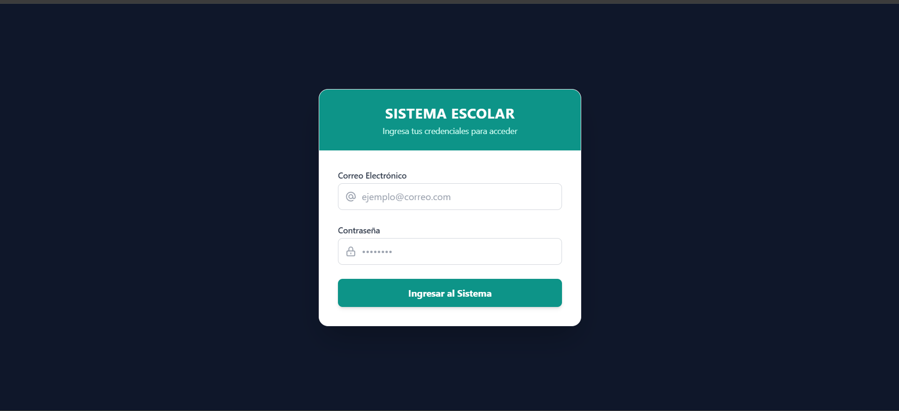
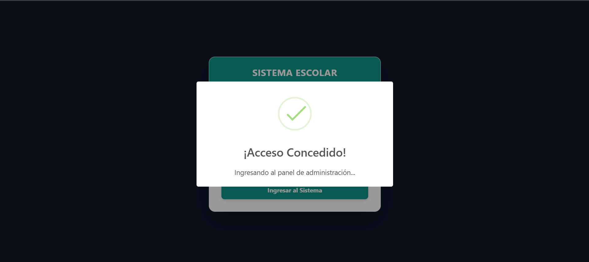
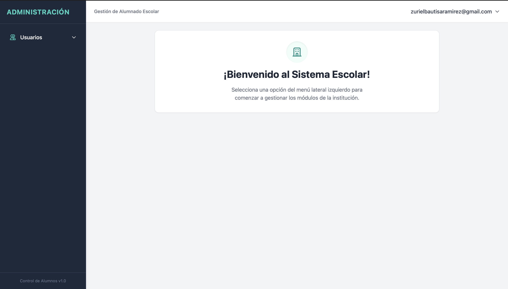
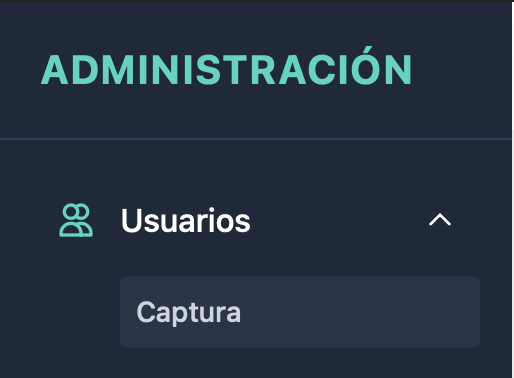
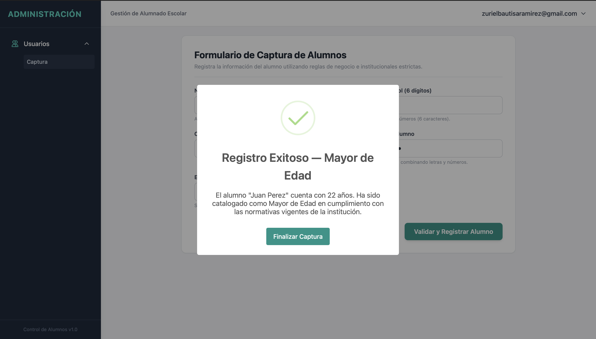
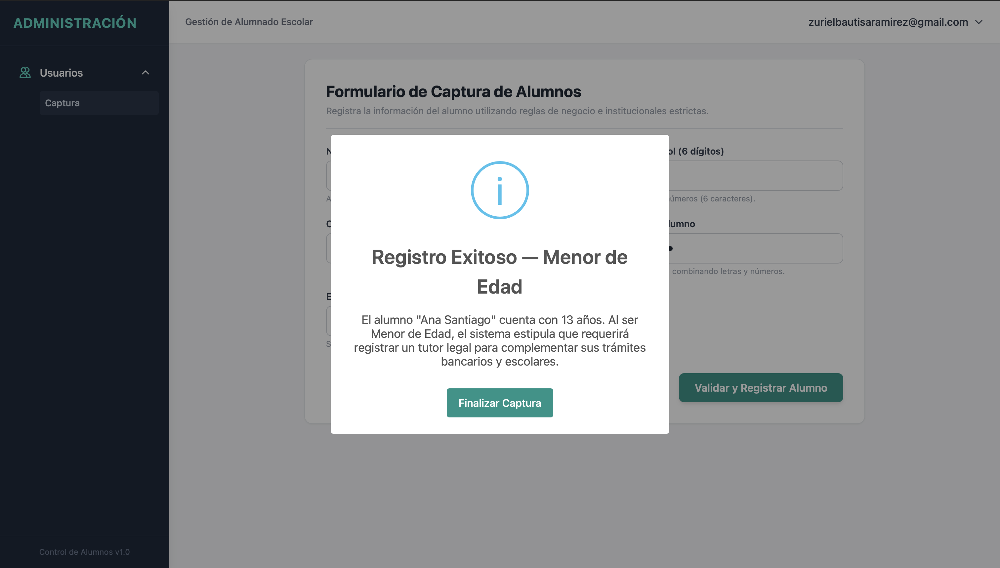
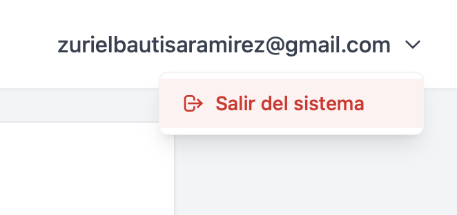
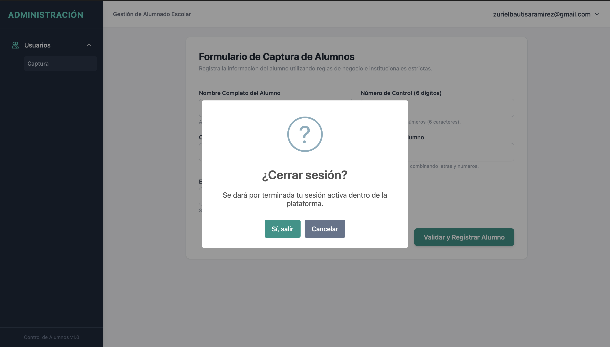

# Sistema de Gestión Escolar y Control de Alumnos

## 📑 Portada e Información del Proyecto

**Institución:** Instituto Tecnologico de Oaxaca  
**Carrera:** Ingeniería en Sistemas Computacionales  
**Semestre:** Curso de verano  
**Proyecto:** Login 
**Fecha:** Julio de 2026  

### 👥 Integrantes del Equipo
*   **Santiago Vasquez David Osmar** 
*   **Bautista Ramirez Amisadai Zuriel** 

---

## 📝 Descripción Breve
Este proyecto consiste en un sistema web modular y responsivo diseñado para la captura y control de alumnos en un entorno institucional. Incluye una pantalla de inicio de sesión segura (`login.html`) y un panel central (`index.html`) que integra un menú lateral dinámico (Sidebar) y una barra de navegación (Navbar). La aplicación se ejecuta de manera local simulando un entorno de producción (SPA) mediante la persistencia segura de tokens de usuario, interceptores de sesión por teclado en tiempo real y el despliegue de alertas estéticas automatizadas.

---

## 🛠️ Documentación Técnica y Arquitectura

### 🎨 Framework CSS Utilizado
Se ha seleccionado **Tailwind CSS (v3.x)** mediante CDN para el desarrollo de la interfaz visual. Los motivos principales de esta elección técnica son:
*   **Utility-First:** Permite construir layouts complejos y componentes responsivos directamente en el archivo HTML mediante clases atómicas, evitando la sobrecarga de hojas de estilo externas monolíticas.
*   **Diseño Fluido y Consistente:** Facilita la aplicación de una paleta de colores profesional (Slate y Teal) y espaciados perfectos mediante la escala nativa de Tailwind.
*   **Flexibilidad Móvil:** El uso de modificadores de pantalla como `md:translate-x-0` y `-translate-x-full` permitió dar una adaptabilidad inmediata a teléfonos, tabletas y computadoras de escritorio de forma nativa.

### 🔄 Flujo de Autenticación (`login.html` ➔ `index.html`)
El sistema utiliza un mecanismo de protección de rutas basado en el almacenamiento del navegador (`localStorage`) para simular la seguridad del backend:
1.  **Interceptación:** Al cargar `login.html`, se evalúa si ya existe una sesión mediante `localStorage.getItem('usuarioActivo')`. Si existe, se redirige inmediatamente a `index.html` usando `window.location.replace()` para evitar la acumulación de historial inválido.
2.  **Validación y Almacenamiento:** Cuando el usuario envía sus datos, se procesan los métodos estrictos de estructura. Si los datos son aptos, se ejecuta la instrucción `localStorage.setItem('usuarioActivo', email)`.
3.  **Redirección Limpia:** Se lanza una alerta de éxito de SweetAlert2 con un temporizador integrado de 1.3 segundos. Al expirar, se despacha la redirección forzada, impidiendo que el usuario pueda regresar al login usando el botón "Atrás" del navegador a menos que cierre sesión formalmente.

### ✉️ Transferencia del Nombre de Usuario al Navbar
Dado que no contamos con una base de datos en servidor activo para este entregable escolar, la persistencia y transporte de datos entre páginas independientes se realiza mediante **Web Storage API**:
*   En `login.js`, el correo o usuario validado se encapsula en la clave estática `'usuarioActivo'`.
*   En `index.js`, la primera línea de ejecución del ciclo de vida del DOM invoca `localStorage.getItem('usuarioActivo')`.
*   Si la clave devuelve `null`, el script asume una violación de seguridad o una sesión inexistente y expulsa al intruso de vuelta a `login.html`.
*   Si se recupera con éxito, se realiza una inyección directa en el árbol DOM mediante la propiedad `textContent`:
    ```javascript
    document.getElementById('navbar-username').textContent = usuarioActivo;
    ```

### 🧠 Métodos Principales y Funciones de Negocio
A continuación se detallan las firmas y lógica interna de las funciones obligatorias del sistema:

*   `validarCorreo(correo)`: Recibe una cadena de texto y ejecuta un test mediante una Expresión Regular (`RegExp`). Evalúa que contenga caracteres alfanuméricos iniciales, el símbolo `@`, un dominio válido y una extensión final de al menos 2 caracteres.
    *   *Regex:* `/^[a-zA-Z0-9._%+-]+@[a-zA-Z0-9.-]+\.[a-zA-Z]{2,}$/`
*   `validarPassword(p)`: Evalúa la solidez criptográfica mínima de la contraseña del alumno. Exige una longitud mínima de 8 caracteres y obliga a que existan de forma simultánea al menos una letra (`/[a-zA-Z]/`) y al menos un dígito numérico (`/\d/`).
*   `lanzarModalEdadCalculada(edad, nombre)`: Intercepta el envío del formulario una vez sanitizado. Si el parámetro numérico `edad` es mayor o igual a `18`, despliega un modal SweetAlert2 con icono de éxito (`icon: 'success'`) catalogándolo como Mayor de Edad. Si es menor, despliega un modal informativo (`icon: 'info'`) indicando los requerimientos de tutoría legal. Ambos métodos limpian el formulario al finalizar.

---

## 🚀 Proceso de Creación Paso a Paso

### Paso 1: Configuración de la Seguridad en el Inicio de Sesión
Se estructuró la interfaz del formulario de acceso en `login.html` aplicando tarjetas centradas con sombras suaves. En el archivo `login.js`, se añadieron escuchas al evento `submit`. Para garantizar la rigurosidad requerida, se añadieron condicionales encadenados que detienen el flujo enviando alertas críticas si el formato de correo electrónico o la fortaleza de la contraseña no cumplen los criterios estipulados por los métodos de validación.

### Paso 2: Construcción del Menú Lateral (Sidebar) Responsivo
Se diseñó un contenedor fijado (`fixed inset-y-0`) con ancho fijo de 64 unidades (`w-64`). Para móviles se desplaza fuera de la pantalla por defecto (`-translate-x-full`) y se controla su visibilidad alternando clases con los botones hamburguesa y de cierre (X). El menú "Usuarios" se configuró como un botón que, mediante el método `classList.toggle('hidden')`, muestra u oculta el submenú dinámico que aloja la opción de **"Captura"**.

### Paso 3: Diseño del Navbar e Integración de Sesión Dinámica
Ubicado en la parte superior derecha de la pantalla de trabajo, se creó un botón interactivo que despliega un submenú flotante absoluto. Este menú contiene la opción **"Salir del sistema"**. Para lograr un comportamiento impecable, el evento de salida elimina por completo la clave de sesión utilizando `localStorage.removeItem('usuarioActivo')` antes de ejecutar la expulsión, garantizando la destrucción total del token del alumno.

### Paso 4: Implementación de Máscaras y Validaciones Estrictas por Teclado
Se detectó que las validaciones tradicionales de HTML5 permitían al usuario escribir letras en campos numéricos y borrarlos solo al dar clic en enviar. Para resolver esto, se integraron escuchas al evento `'input'` directamente en los campos críticos:
*   **Nombre Completo:** Se aplica la expresión regular `/[^a-zA-ZáéíóúÁÉÍÓÚñÑ\s]/g` para eliminar instantáneamente cualquier número o carácter especial mientras el usuario escribe.
*   **Número de Control y Edad:** Se utiliza `/[^0-9]/g` para rechazar de manera física en el teclado cualquier carácter que no pertenezca al espectro numérico absoluto. Además, el número de control se restringe mediante el atributo `maxlength="6"`.

### Paso 5: Creación del Ruteo de Vistas Internas y el Modal de Edad
Para otorgarle utilidad al submenú **"Captura"** (tal como se ilustra en la referencia visual `image_bd98c7.png`), se dividió el espacio de trabajo principal de `index.html` en dos capas utilizando identificadores únicos:
*   `vista-bienvenida`: Se muestra por defecto al cargar la página.
*   `vista-captura`: Inicia oculta con la clase `hidden`.

Se programó un disparador para que, al hacer clic en el enlace "Captura" del menú lateral, se alternen las clases de Tailwind, ocultando la bienvenida y presentando el formulario de alumnos de manera fluida. Al enviar los datos, se procesa el número de control (exigiendo exactamente 6 dígitos) y se bifurca la respuesta mediante la función evaluadora de edad, activando el modal interactivo correspondiente.

---

## 📸 Capturas de Pantalla del Flujo Completo


1.  **Pantalla de Login Activa (`login.html`):** Muestra el formulario centrado y los controles listos para validar formatos de correo institucional y contraseñas seguras.

2.  **Validaciones de Entrada en Tiempo Real:** Demostración de cómo los campos de texto purgan caracteres inválidos al escribir en el teclado de forma estricta.

3.  **Panel Principal - Vista de Bienvenida (`index.html`):** Estado inicial del sistema al iniciar sesión con éxito, mostrando el nombre recuperado dinámicamente en el Navbar y la pantalla de bienvenida limpia.

4.  **Interacción con el Sidebar y Submenú (Referencia `image_bd98c7.png`):** Apertura del menú desplegable "Usuarios" y selección de la opción **"Captura"** para renderizar el formulario.

5.  **Despliegue del Modal de Alumno Mayor de Edad:** Ventana emergente SweetAlert2 de éxito tras capturar un alumno con edad $\ge 18$ años y número de control válido de 6 dígitos.

6.  **Despliegue del Modal de Alumno Menor de Edad:** Ventana emergente SweetAlert2 informativa tras capturar un alumno menor de edad, notificando el estatus especial de tutoría.

7.  **Cierre Seguro de Sesión:** Despliegue del cuadro de confirmación al dar clic en "Salir del sistema" en el Navbar y regreso automático al estado de login protegido.


